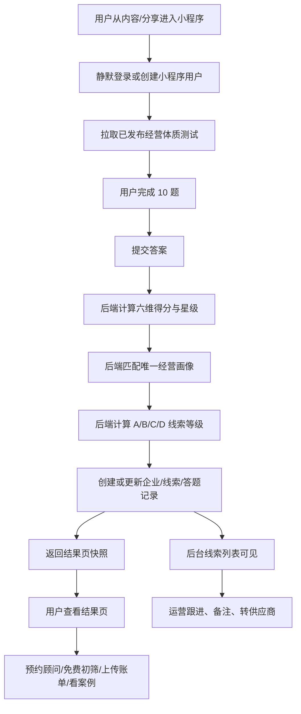

# 经营体质测试需求开发设计文档

版本：v0.1
来源：`推广、产品、运营一体建设思路.docx` 中「二、产品设计」章节
适用范围：小程序获客测评、结果页转化、后台线索承接、运营跟进闭环

---

## 1. 背景与目标

本需求不是单独做一套问卷页面，而是建设一条完整的获客链路：

```text
推广内容引流
  -> 小程序经营体质测试
  -> 六维评分与经营画像
  -> 结果页 CTA 引导留资 / 初筛 / 加企微
  -> 后台生成线索并分级
  -> 运营按线索等级跟进
  -> 后续服务需求、账单、供应商撮合沉淀
```

第一版目标是让用户尽可能低摩擦地完成答题，并留下可运营的需求信号。系统需要在答题提交后自动完成评分、画像、线索分级、需求标签沉淀，并把线索交给后台运营人员。

---

## 2. 需求解读

### 2.1 核心业务对象

| 对象 | 说明 | 当前仓库承接模块 |
|---|---|---|
| 问卷版本 | 经营体质测试 v1，包含 10 道单选题 | `questionnaire` |
| 题目与选项 | 前端展示文案、选项、排序、是否必答 | `questionnaire_questions`、`questionnaire_options` |
| 评分维度 | CP、MA、SR、EP、AM、LV 六个维度 | `questionnaire_options.score_json`、`questionnaire_submissions.dimension_scores_json` |
| 经营画像 | 用户最终展示一种画像 | `questionnaire_result_profiles`、`questionnaire_submissions.profile_code` |
| 星级展示 | 每个维度按得分转换为 1-5 星 | 建议进入提交响应与结果快照 |
| 线索等级 | A/B/C/D，决定后台跟进优先级 | `lead` 模块 |
| 运营动作 | 24 小时跟进、3 天触达、内容培育等 | `crm`、`lead`、运营 SOP |

### 2.2 六维评分模型

| 维度 | 名称 | 用途 |
|---|---|---|
| CP | 成本压力指数 | 判断企业是否有明显成本压力或降本诉求 |
| MA | 管理模糊指数 | 判断用户是否路径不清、说不清问题在哪里 |
| SR | 供应商信息差指数 | 判断供应商筛选、比价、报价复核、合同把关需求 |
| EP | 用能优化潜力指数 | 判断售电、绿电、光伏、储能、节能、运维等能源服务机会 |
| AM | 行动成熟度指数 | 判断用户近期是否愿意行动或被联系 |
| LV | 线索价值系数 | 结合企业规模、类型、区域判断潜在项目价值 |

产品口径：CP、MA、SR、EP 决定经营画像；AM、LV 主要决定运营优先级和线索等级。

### 2.3 星级换算

| 得分区间 | 星级 | 前端解释 |
|---|---:|---|
| 0-2 | 1 星 | 暂时不明显 |
| 3-5 | 2 星 | 存在轻微信号 |
| 6-8 | 3 星 | 值得关注 |
| 9-11 | 4 星 | 比较明显 |
| 12 及以上 | 5 星 | 建议优先处理 |

后端应返回 `dimension_scores` 与 `dimension_stars`，前端只负责展示，不在前端重复计算。

### 2.4 画像类型

开发建议以结果页六类为准，统一 profile code：

| profile_code | 前端名称 | 命中方向 |
|---|---|---|
| `cost_sensitive` | 成本敏感型 | CP 高，成本压力明显 |
| `hidden_waste` | 隐性浪费型 | MA 高，路径不清、漏钱点不明确 |
| `growth_expansion` | 增长扩张型 | MA、LV、CP 均有信号，扩张带来成本管理压力 |
| `stable_operation` | 稳健经营型 | CP、MA、SR、EP 较低，适合轻体检和培育 |
| `energy_awakened` | 能源觉醒型 | EP 高，电费或用能优化潜力明显 |
| `supplier_confused` | 供应商困惑型 | SR 高，报价复核、服务商筛选或合同把关需求明显 |

### 2.5 线索等级

| 等级 | 判断条件 | 运营动作 |
|---|---|---|
| A 类 高意向 | AM >= 8 且 LV >= 4 | 7 天内跟进，直接推顾问预约；运营上建议 24 小时内首次触达 |
| B 类 近期意向 | AM 5-7 或 LV >= 3 | 1 周内触达，推免费初筛 |
| C 类 培育型 | AM 2-4 | 加入内容推送序列，定期触达 |
| D 类 观望型 | AM 0-1 | 推文章/案例，轻触达，不强推销售 |

---

## 3. 口径冲突与待确认项

产品设计章节内部存在几处需要上线前统一的口径：

| 问题 | 当前表现 | 开发建议 |
|---|---|---|
| 题号不一致 | 前文 Q1 是“每月用电量”，后文完整计分中 Q1 是“区域标签”，Q2 才是“每月用电量” | 以“完整计分明细”作为 v1 开发基准；区域题为 Q1，只打标签不计分 |
| Q8/Q9 题目不一致 | 前文出现“电费账单看到哪一步”，但完整计分中 Q8 是供应商帮助方式，Q9 是用能状态 | 若要严格按完整计分上线，账单查看题先不进入 v1；若保留，需要产品补评分规则 |
| 画像命名不一致 | 前文有“用能优化潜力型 / 供应商信息差型”，结果页是“能源觉醒型 / 供应商困惑型” | 前端展示采用结果页命名；后端 code 固定，不随文案变化 |
| 画像匹配规则不一致 | 表格里有一版触发阈值，Step 3 又给出另一套优先级顺序 | v1 采用 Step 3：隐性浪费 -> 能源觉醒 -> 供应商困惑 -> 成本敏感 -> 增长扩张 -> 稳健经营 |
| 线索等级不一致 | 旧 MVP 文档是 A/B/C，新产品设计是 A/B/C/D | 本需求采用 A/B/C/D；旧后台筛选与统计同步扩展 D 类 |
| 结果页数据依据 | 结果页使用行业经验值与同类企业经验值 | 前端展示需带免责声明：实际情况需结合账单进一步判断 |

---

## 4. 整体分工

| 角色 | 主要职责 | 输出物 |
|---|---|---|
| 产品 | 冻结 10 题顺序、选项文案、计分表、画像优先级、结果页文案、CTA 文案 | 问卷配置表、画像规则表、结果页内容表 |
| 设计 | 小程序答题页、结果页、星级/雷达展示、CTA、分享卡片；后台线索列表与详情视觉 | Figma 页面、组件状态、空态/错误态 |
| 小程序前端 | 答题流程、进度、提交、结果页、CTA 到初筛/企微/案例、分享回流参数 | `apps/miniapp` 页面与 API service |
| 后台前端 | 线索列表、筛选、详情、画像与评分展示、跟进/备注/转供应商动作 | `apps/admin-web` 页面与 API service |
| 后端 | 问卷配置、评分计算、画像匹配、线索生成/更新、后台查询、CRM 动作、审计 | `services/api` 模块、迁移、单元测试 |
| 数据库 | 补齐企业、线索、CRM、初筛、账单表；调整线索等级与画像枚举 | Alembic migration、种子数据 |
| 运营 | 定义 A/B/C/D 对应触达 SOP、企微话术、社群标签、二次触达节奏 | 运营动作手册、标签库 |
| 测试 | 覆盖题目提交、评分边界、画像优先级、线索分级、后台筛选、权限 | 测试用例、回归记录 |

---

## 5. 业务流程设计



关键原则：

1. 用户答题前不强制手机号授权，降低流失；可以使用微信静默登录建立 `app_user`。
2. 手机号、账单、企业信息放在结果页 CTA 和初筛流程中逐步获取。
3. 所有评分、画像、线索等级以后端结果为准，前端不写业务判断。
4. 提交结果必须保存快照，避免后续题库或文案改版影响历史记录。

---

## 6. 后端开发设计

### 6.1 模块边界

| 模块 | 本需求工作 |
|---|---|
| `questionnaire` | 承载问卷、选项、评分、画像、答题提交、结果快照 |
| `lead` | 根据答题结果创建/更新线索，提供后台列表和详情 |
| `enterprise` | 逐步沉淀企业区域、类型、规模、联系人信息 |
| `screening` | 结果页 CTA 的免费初筛承接 |
| `service_request` | 供应商、用能、报价复核等服务需求承接 |
| `crm` | 跟进记录、备注、下次跟进时间 |
| `statistics` | 后台总线索、A/B/C/D 线索、待跟进、转化率统计 |
| `security_audit` | 查看敏感手机号、账单下载、转供应商等操作日志 |

### 6.2 评分实现

现有 `questionnaire_options.score_json` 已可存储选项对不同维度的加分，建议 v1 使用以下格式：

```json
{
  "EP": 3,
  "LV": 2,
  "AM": 1
}
```

提交时后端执行：

```text
1. 校验问卷已发布、题目存在、必答题已答、单选题只有一个选项。
2. 按选项 score_json 独立累加 CP / MA / SR / EP / AM / LV。
3. Q1 区域题不计数字分，写入 answer_tags.region。
4. 将各维度得分转换为星级。
5. 按固定优先级匹配唯一画像。
6. 按 AM + LV 计算线索等级。
7. 生成 result_snapshot_json，保存前端结果页所需全部文案和 CTA。
8. 创建或更新 lead，写入 profile_code、lead_grade、primary_need_type、标签和最近活动时间。
```

### 6.3 画像匹配规则

建议 v1 固定实现以下优先级，避免只靠数据库 `id` 或简单阈值导致画像不稳定：

```text
1. hidden_waste:
   MA 为最高分且 MA >= 5；或 MA >= 5 且 CP >= 3

2. energy_awakened:
   EP 为最高分且 EP >= 5

3. supplier_confused:
   SR 为最高分且 SR >= 6，且未优先命中 energy_awakened

4. cost_sensitive:
   CP >= 6

5. growth_expansion:
   MA >= 3 且 LV >= 3，或命中扩张选项标签

6. stable_operation:
   兜底画像
```

如果产品希望后台可配置规则，可以继续使用 `questionnaire_result_profiles.rule_json`，但需要扩展服务层支持：

```json
{
  "priority": 10,
  "dominant_dimension": "MA",
  "min_scores": { "MA": 5, "CP": 3 },
  "exclude_profiles": []
}
```

### 6.4 线索创建与更新

答题提交后，不能只保存 `questionnaire_submission`。需要进入线索体系：

| 场景 | 处理方式 |
|---|---|
| 用户首次答题，无企业信息 | 创建轻量企业占位或延迟企业创建；创建 lead，source_entry = `questionnaire` |
| 用户已有 enterprise_id | 关联企业并更新 lead |
| 用户已有 lead_id | 更新同一线索的画像、等级、最近活动 |
| 后续提交初筛/需求/账单 | 合并到同一 lead，提升 `has_bill_uploaded`、`has_phone_authorized`、`primary_need_type` 等字段 |

推荐 lead 快照字段：

| 字段 | 说明 |
|---|---|
| `profile_code` | 命中画像 |
| `lead_grade` | A/B/C/D |
| `primary_need_type` | 用能、供应商、报价复核等主需求 |
| `score_snapshot_json` | 六维得分、星级、区域标签 |
| `need_tags_json` | 需求标签，如“报价复核”“用能初筛”“供应商筛选” |
| `last_activity_at` | 最近答题/留资/上传资料时间 |

若不想新增字段，至少要把这些信息放入 `questionnaire_submissions.result_snapshot_json`，并在后台详情聚合展示。

### 6.5 数据库与迁移

当前迁移已创建认证和问卷核心表，但还需要补齐以下数据底座：

1. `enterprises`、`enterprise_contacts`
2. `leads`、`lead_status_logs`
3. `screening_requests`
4. `service_requests`、`service_request_items`
5. `files`、`bill_uploads`
6. `lead_followups`、`lead_notes`
7. `supplier_transfers`
8. `audit_logs`

兼容调整：

1. `leads.lead_grade` 支持 `A`、`B`、`C`、`D`。
2. `questionnaire_submissions.dimension_scores_json` 使用大写维度 key：`CP`、`MA`、`SR`、`EP`、`AM`、`LV`。
3. `questionnaire_result_profiles` 增加六类画像配置和结果页文案。
4. 问卷种子数据建议使用脚本或后台接口导入，避免手工录入出错。

### 6.6 小程序端 API

| 方法 | 路径 | 用途 |
|---|---|---|
| GET | `/api/app/questionnaires/current?code=business_health` | 获取当前已发布问卷 |
| POST | `/api/app/questionnaires/{questionnaire_id}/submissions` | 提交答题，返回结果快照、画像、星级、线索等级 |
| GET | `/api/app/questionnaires/submissions/{submission_id}` | 读取历史答题结果 |
| POST | `/api/app/screening-requests` | 结果页免费初筛 |
| POST | `/api/app/service-requests` | 提交服务需求 |
| POST | `/api/app/files` | 上传账单或资料 |

建议提交响应增加字段：

```json
{
  "id": 1001,
  "lead_id": 2001,
  "profile_code": "energy_awakened",
  "profile_name": "能源觉醒型",
  "lead_grade": "A",
  "dimension_scores": { "CP": 4, "MA": 2, "SR": 1, "EP": 9, "AM": 8, "LV": 4 },
  "dimension_stars": { "CP": 2, "MA": 1, "SR": 1, "EP": 4, "AM": 3, "LV": 2 },
  "result": {
    "headline": "电费这件事，你可能一直在交冤枉钱",
    "benchmark": "10%-25%",
    "signals": [],
    "cta": {}
  },
  "answers_snapshot": []
}
```

### 6.7 后台 API

| 方法 | 路径 | 用途 |
|---|---|---|
| GET | `/api/admin/leads` | 线索列表，支持等级、画像、状态、需求、时间筛选 |
| GET | `/api/admin/leads/{lead_id}` | 线索详情，聚合企业、答题、初筛、需求、账单、跟进 |
| POST | `/api/admin/leads/{lead_id}/status` | 更新线索状态 |
| POST | `/api/admin/crm/followups` | 新增跟进记录 |
| POST | `/api/admin/crm/notes` | 新增备注 |
| POST | `/api/admin/suppliers/transfers` | 转供应商 |
| GET | `/api/admin/dashboard/summary` | 统计概览 |
| GET | `/api/admin/questionnaires` | 问卷配置管理 |

---

## 7. 小程序前端设计

### 7.1 页面范围

| 页面 | 工作内容 |
|---|---|
| `pages/home` | 推广入口、开始测试、承接分享参数 |
| `pages/questionnaire` | 拉取问卷、题目进度、选项选择、提交、错误处理 |
| `pages/questionnaire-result` | 展示画像、星级/雷达、信号、行业参照、CTA |
| `pages/screening` | 免费初筛表单，补充企业、地区、电话、账单 |
| `pages/service-request` | 用能/供应商/报价复核等服务需求提交 |
| `pages/share-card` | 分享卡片或分享落地页 |

### 7.2 答题页交互

1. 进入页面后调用当前问卷接口。
2. 题目按 `sort_order` 展示，默认单题单屏或轻量分页。
3. 每题只能选择一个选项，已选项高亮。
4. 展示进度，例如 `3/10`。
5. 未完成必答题不允许提交。
6. 提交时显示 loading，防重复点击。
7. 提交成功后携带 `submissionId` 跳转结果页。
8. 提交失败时保留已选答案，允许重试。

### 7.3 结果页交互

结果页结构建议：

```text
画像标题
一句核心判断
行业数字参照与免责声明
六维星级 / 雷达
我们发现的信号
下一步建议
主 CTA：免费预约顾问 / 免费初筛
次 CTA：上传账单 / 查看案例 / 加企微或进群
```

前端注意：

1. 结果页所有关键文案尽量来自后端快照，方便后续 A/B 测试。
2. 数字参照必须展示来源或免责声明。
3. CTA 根据 `lead_grade` 和 `profile_code` 调整优先级，但展示决策也应由后端返回配置。
4. 用户不愿留资时，保留“看案例/看清单”的轻触达路径。

---

## 8. 后台前端设计

### 8.1 线索列表

列表字段：

| 字段 | 说明 |
|---|---|
| 企业 / 用户 | 企业简称为空时展示微信用户或“未留企业信息” |
| 来源 | 体质测试、免费初筛、服务需求、分享回流 |
| 画像 | 六类画像 |
| 线索等级 | A/B/C/D |
| 需求标签 | 用能初筛、报价复核、供应商筛选、合同把关等 |
| 地区 | Q1 区域标签或企业地区 |
| 状态 | 待跟进、跟进中、已转供应商、内容留存、关闭 |
| 最近活动 | 答题、留资、上传账单、跟进时间 |

筛选项：

1. 线索等级：全部、A、B、C、D
2. 画像类型
3. 需求方向
4. 状态
5. 是否授权手机号
6. 是否上传账单
7. 时间范围

### 8.2 线索详情

详情页区块：

1. 线索概览：等级、状态、画像、负责人、最近活动。
2. 企业与联系人：企业名称、地区、类型、手机号脱敏展示。
3. 测评结果：六维分数、星级、命中画像、答案快照。
4. 运营建议：后端根据等级返回的跟进建议。
5. 初筛/服务需求：用户后续提交内容。
6. 账单资料：上传状态与敏感文件查看入口。
7. 跟进记录：电话、企微、社群、线下等。
8. 操作区：发起跟进、添加备注、转供应商、关闭线索。

敏感操作要求：

1. 查看完整手机号需要权限，并写审计日志。
2. 下载或查看账单需要权限，并写审计日志。
3. 转供应商需要记录操作人、供应商、转接原因。

---

## 9. 种子数据与配置

v1 不建议运营人员直接从后台逐条录入问卷，容易出现计分错误。建议开发提供一份结构化配置文件或种子脚本：

```text
questionnaire_code = business_health
version = v1
questions = 10
dimensions = CP / MA / SR / EP / AM / LV
profiles = 6
lead_grades = A / B / C / D
```

配置文件应包含：

1. 题目标题、说明、排序。
2. 选项 label、展示文案、排序。
3. 每个选项的 `score_json`。
4. 区域标签、扩张标签、需求标签。
5. 结果页六类文案、信号、CTA、免责声明。
6. 画像优先级与命中规则。

---

## 10. 开发顺序

### 阶段 0：口径冻结

1. 产品确认最终 10 题顺序。
2. 产品确认 Q8/Q9 是否保留“账单查看程度”题。
3. 产品确认六类画像命名、优先级、结果页文案。
4. 运营确认 A/B/C/D 的触达时效和话术。

### 阶段 1：数据底座

1. 补齐企业、线索、CRM、初筛、账单、审计迁移。
2. lead 支持 A/B/C/D。
3. 问卷种子数据导入。
4. 增加画像和结果页配置。

### 阶段 2：后端闭环

1. 完成六维评分与星级转换。
2. 完成固定优先级画像匹配。
3. 完成线索等级计算。
4. 提交答题后创建/更新 lead。
5. 后台线索列表、详情、跟进、备注 API。
6. 单元测试覆盖评分和边界。

### 阶段 3：小程序闭环

1. 问卷页。
2. 结果页。
3. 初筛/服务需求 CTA。
4. 账单上传入口。
5. 分享参数承接。

### 阶段 4：后台闭环

1. 线索列表和筛选。
2. 线索详情。
3. 跟进、备注、状态流转。
4. 转供应商。
5. 统计概览。

### 阶段 5：联调与上线

1. 用产品给定样例跑通六类画像。
2. 验证 A/B/C/D 边界。
3. 验证后台筛选和详情聚合。
4. 验证敏感数据权限和审计。
5. 预置运营账号、供应商样例、测试问卷版本。

---

## 11. 测试设计

### 11.1 后端单元测试

| 用例 | 验证点 |
|---|---|
| 单选题重复选项 | 返回 400 |
| 必答题缺失 | 返回 400 |
| Q1 区域题 | 只写标签，不增加总分 |
| 星级转换边界 | 2/3/5/6/8/9/11/12 分正确 |
| 画像优先级冲突 | 同时满足多个画像时按固定优先级输出唯一画像 |
| AM/LV 等级边界 | AM=8、LV=4 命中 A；AM=5 命中 B；AM=2 命中 C；AM=1 命中 D |
| 提交后 lead 创建 | submission 与 lead 关联 |
| 再次提交 | 同用户同企业更新或生成新活动记录，规则明确 |

### 11.2 前端测试

| 场景 | 验证点 |
|---|---|
| 正常答题 | 10 题完成并提交 |
| 网络失败 | 保留答案并允许重试 |
| 结果页 | 展示画像、星级、信号、CTA、免责声明 |
| CTA | 可进入初筛、服务需求、上传账单 |
| 分享回流 | 分享参数可被读取并上报 |

### 11.3 后台测试

| 场景 | 验证点 |
|---|---|
| 线索列表 | 可按等级、画像、状态筛选 |
| 线索详情 | 能看到答题快照、评分、企业、跟进记录 |
| 跟进动作 | 写入 followup 并更新线索状态 |
| 敏感查看 | 权限校验与审计日志 |
| 转供应商 | 写入转接记录并更新线索状态 |

---

## 12. 验收标准

1. 用户可以从小程序完成经营体质测试并看到六类画像之一。
2. 后端返回六维分数、星级、画像、线索等级、结果页快照。
3. 每次答题提交都会保存答案快照、结果快照，并创建或更新线索。
4. 后台可以看到该线索，并按 A/B/C/D、画像、状态筛选。
5. 后台详情能展示答题结果、运营建议、跟进记录和后续需求。
6. A 类线索能被运营快速识别并进入跟进。
7. 结果页免责声明完整，不能把经验值包装成用户实际可节省金额。
8. 评分和画像规则有单元测试覆盖，产品给定样例与系统输出一致。

---

## 13. 与现有工程的差距

| 范围 | 当前状态 | 需要补齐 |
|---|---|---|
| 后端问卷 | 已有题库、选项、`score_json`、提交、基础 profile 匹配 | 六维星级、固定画像优先级、A/B/C/D 线索等级、lead 联动 |
| 后端线索 | `lead` 模块基本占位 | 模型、迁移、repository、service、后台 router |
| 数据库迁移 | 已有认证和问卷核心表 | 企业、线索、CRM、初筛、账单、审计等表 |
| 小程序问卷 | 页面与 API service 占位 | 完整答题页、结果页、CTA |
| 后台线索 | 页面与 API service 占位 | 列表、详情、跟进、备注、转供应商 |
| 测试 | 只有基础问卷评分测试 | 产品规则边界与闭环测试 |

---

## 14. 建议结论

本需求建议按“后端评分与线索闭环优先、小程序体验并行、后台承接随后联调”的顺序推进。原因是评分、画像、线索等级一旦没有后端统一口径，小程序和后台都会出现重复判断，后续改规则成本高。

优先级最高的三个工程动作：

1. 产品先冻结最终 10 题和画像规则。
2. 后端补齐评分结果结构与 lead 自动创建/更新。
3. 小程序完成答题结果页和留资 CTA，后台完成 A/B/C/D 线索承接。
